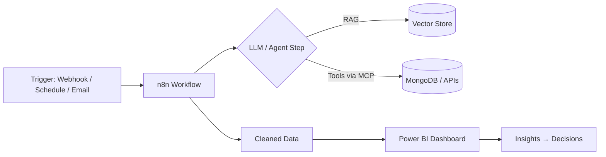

<!-- =========================================================
  SETUP: find/replace  em25mtech11008-glitch  -> your GitHub em25mtech11008-glitch
         find/replace  YOUR-LINKEDIN -> your LinkedIn slug
  Put this file in a repo named exactly as your em25mtech11008-glitch.
========================================================= -->

<div align="center">


<a href="https://git.io/typing-svg">
  
</a>

<br/>


</div>

---

## `> whoami`

```python
class Parth:
    def __init__(self):
        self.role      = "M.Tech Techno-Entrepreneurship @ IIT Hyderabad"
        self.focus     = ["Multi-Agent AI", "LLM Fine-tuning", "MLOps", "Quant Finance"]
        self.automates = ["n8n workflows", "Power BI dashboards", "RAG pipelines"]
        self.previously = ["Software Intern @ Shreeji Software", "Data Analytics Intern @ IBM SkillsBuild"]
        self.off_duty  = ["Farming & gardening", "Self-sufficient farmhouse dev", "Travel"]

    def now(self):
        return "Building AI systems that ship, not just demo."
```

<table>
<tr>
<td>

🔭 **Building** — Distributed GPU resource-sharing platform
🧠 **Exploring** — Agentic workflows (LangGraph · MCP · n8n)
📈 **Researching** — Sustainable GPU data-center optimization
🌱 **Learning** — Production LLM serving & evals

</td>
</tr>
</table>

---

## 🛠️ Tech Arsenal

**Languages**


**AI / LLM / Agents**


**Automation & BI**


**ML / Data Science**


**Backend, DevOps & MLOps**


**Frontend (when needed)**


**CS Foundations** — DSA · OOP · DBMS · Operating Systems · Computer Networks · Network Security · Statistics & Probability

---

## 🚀 Featured Projects

<table>
<tr>
<td width="50%" valign="top">

### 🌾 [Crop Disease Advisor](https://github.com/em25mtech11008-glitch/crop-disease-advisor)
End-to-end MLOps: leaf photo → 38-class diagnosis → structured, region-aware treatment plan.

- **EfficientNet-B4** vision model — **96.8% test acc**, 95.4% macro-F1
- **Qwen2.5-3B QLoRA** advisor — **100% JSON validity & schema compliance**
- W&B tracking, accuracy-gated model registry, HF Hub, Docker, Render

`PyTorch` `QLoRA` `FastAPI` `Vite` `W&B` `Docker`

[🚀 Live Demo](https://crop-disease-advisor.onrender.com/) · [🤗 Space](https://huggingface.co/spaces/spidey1807/crop-disease-advisor)

</td>
<td width="50%" valign="top">

### 🏢 [AI Operations Command Center](https://github.com/em25mtech11008-glitch/company-ai-assistant)
Multi-agent "AI workforce" for startups: Finance, Sales, HR, Support, Ops, Knowledge.

- **9 agents** (1 supervisor + 8 specialists) on **LangGraph**
- **14 MCP tools** · **17 REST endpoints** · **11+ Mongo collections**
- RAG over PDFs, JWT + RBAC, human-in-the-loop approvals with audit log

`LangGraph` `MCP` `FastAPI` `MongoDB` `React` `Gemini`

</td>
</tr>
<tr>
<td width="50%" valign="top">

### 🧠 [Llama 3.2 3B — "Thinking" Fine-tune](https://github.com/em25mtech11008-glitch/llama-3.2-3b-unsloth-thinking)
Taught a 3B model stream-of-consciousness reasoning using **Unsloth + QLoRA** on R1-Distill-SFT.

- 4-bit QLoRA, r=16 across attention + MLP layers
- Exported to **GGUF (Q8_0)** and served locally with Ollama

`Unsloth` `TRL` `PEFT` `GGUF` `Ollama`

</td>
<td width="50%" valign="top">

### 📈 Indian Statistical Arbitrage Engine
Pairs-trading system on live **NSE / NIFTY 500** data.

- Cointegration, **Kalman-filter hedge ratios**, adaptive Z-score signals
- Beta-neutral sizing, Indian transaction costs, next-day execution (no lookahead)
- Validated via **walk-forward out-of-sample** testing

`Python` `Statsmodels` `Pandas` `Quant`

</td>
</tr>
<tr>
<td width="50%" valign="top">

### ⚡ Sustainable GPU Data Center Optimization
Optimization models for GPU data-center **site selection & scheduling**.

- Integer programming + **Nash bargaining** for cost, renewable energy, and resource allocation

`MILP` `Optimization` `Python`

</td>
<td width="50%" valign="top">

### 🖥️ Distributed GPU Resource Sharing Platform
Secure marketplace for underutilized GPUs so researchers, startups, and small teams can access affordable AI compute.

`In progress` `Distributed Systems` `AI Infra`

</td>
</tr>
</table>

<details>
<summary><b>📊 More: Student Performance Prediction · Power BI dashboards</b></summary>
<br/>

- **Student Performance Prediction** — end-to-end ML pipeline (Scikit-learn, CatBoost, XGBoost) deployed as a Flask app for real-time predictions.
- **Sales & Profitability Dashboards** — interactive Power BI reports with DAX built during the IBM SkillsBuild internship.

</details>

---

## 🤖 Automation & BI Stack



- **n8n** — event-driven automations, LLM-in-the-loop workflows, API/webhook orchestration
- **Power BI** — data modeling, DAX measures, sales & profitability dashboards

---

## 📊 GitHub Stats

<div align="center">


</div>

<!-- Optional: contribution snake. Add snake.yml to .github/workflows/ then uncomment.
<div align="center">
  <picture>
    <source media="(prefers-color-scheme: dark)" srcset="https://raw.githubusercontent.com/em25mtech11008-glitch/em25mtech11008-glitch/output/github-snake-dark.svg" />
    
  </picture>
</div>
-->

---

## 🎓 Education & Experience

| | |
|---|---|
| 🎓 **M.Tech, Techno-Entrepreneurship** | IIT Hyderabad · 2027 |
| 🎓 **B.E., Information Technology** | L.D. College of Engineering · 2025 |
| 💼 **Software Intern** | Shreeji Software · Feb–May 2025 — DB schemas & data models for a fintech solar-investment platform |
| 💼 **Data Analytics Intern** | CSRBOX – IBM SkillsBuild · Jun–Jul 2024 — Power BI + DAX dashboards |
| 🤝 **Head, Visitor & Exhibitor Relations** | MSME Tech Connect 2026 — led IIT/NIT outreach |
| 🌏 **Programs** | Tongali Entrepreneurship Program · Kyoto University Student Immersion Program |

---

## 🤝 Let's Connect

<div align="center">

[](https://www.linkedin.com/in/YOUR-LINKEDIN)
[](mailto:em25mtech11008@iith.ac.in)
[](https://huggingface.co/spidey1807)

<br/>


</div>
